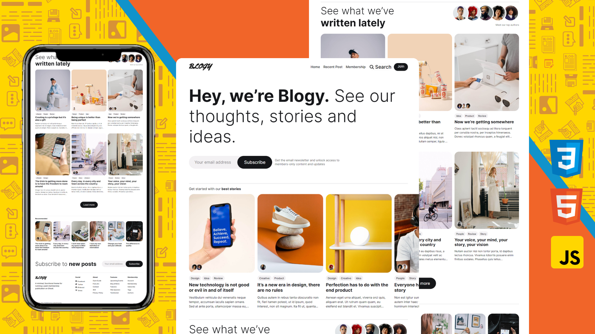

  
  
  
  

   
   

  <h2 align="center">Blogy</h2>

  Blogy é um site para blogy no geral, ele é totalmente responsivo, para celulares, tablets e computadores, construído com HTML, CSS E JAVASCRIPT

  <a href="https://ichumbo-blogy.netlify.app"><strong>➥ Site</strong></a>

 

### Demo Screeshots

### Contact

Se você quiser entrar em contato comigo, pode entrar em contato comigo em [Linkedin](https://www.linkedin.com/in/ichumbo/).